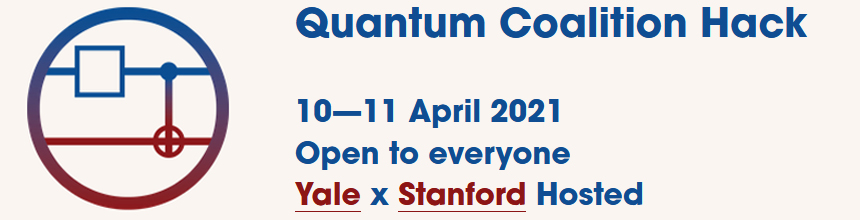
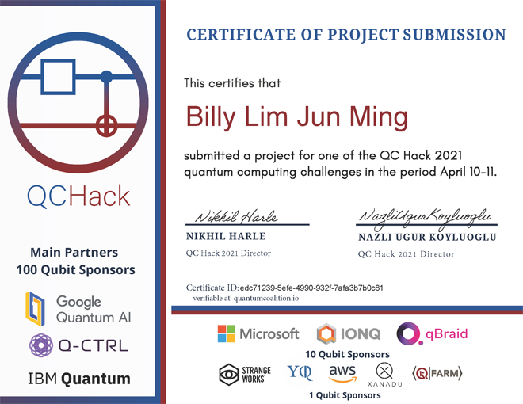

  
  
# Quantum Coalition Hack - Microsoft Challenge  
  
These are my solutions to Microsoft's challenge in [QCHack 2021](https://www.quantumcoalition.io/)  
The original challenge repository can be found at [/quantumcoalition/qchack-microsoft-challenge](https://github.com/quantumcoalition/qchack-microsoft-challenge)  
I only completed the structured part of the challenge, which involved implementing specific oracle circuits  
  
## Hackathon Details  
**Site**: [QuantumCoalition.io](https://www.quantumcoalition.io/)  
**Date**: April 2021  

## Certificate
  
  
## Files  
There were a total of 4 tasks, divided individually into their own folders.  
The solutions had to be written in Q#, and were meant to be edited/run in Visual Studio.  
VSCode users have to load the entire folders, while VS users loads the `.sln` files.  
The provided test cases can then be run with the command `dotnet test` in the console.  
  
## Topics  
| Task    | Link            | Topic                                                      | Points    |  
|---------|-----------------|------------------------------------------------------------|-----------|  
| `Task1` | [link](./Task1) | f(x) = 1 if x is divisible by 4                            | 1 point   |  
| `Task2` | [link](./Task2) | f(x) = 1 if at least two of three input bits are different | 2 points  |  
| `Task3` | [link](./Task3) | Task 2, but strictly without 3-qubit gates                 | 4 points  |  
| `Task4` | [link](./Task4) | f(x) = 1 if the graph edge colouring is triangle-free      | 12 points |  
  